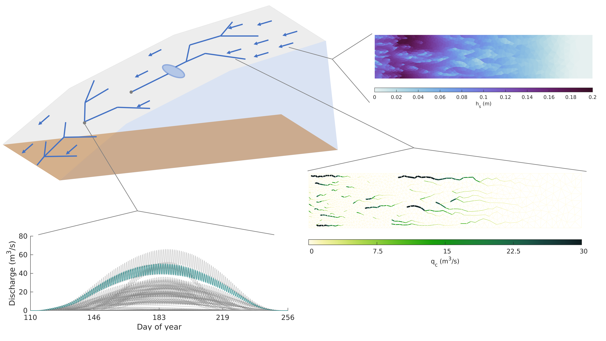

# The Subaerial Drainage System (SaDS) model
These pages aim to describe the SaDS model and explain functionally how to run the model and work with its outputs.

## Summary
SaDS models supraglacial meltwater flow in order to calculate the rate of flow into moulins. It does this by following the structure of GlaDS [(Werder et al., 2013)](https://doi.org/10.1002/jgrf.20146). Water flows across the glacier surface in a distributed sheet and through supraglacial rivers. The entire drainage system evolves throughout the melt season depending on the balance between surface melt and heat dissipation in the channels.

## This documentation
For more details about the mathematical basis of the model, see the paper (TBD). The rest of this documentation focuses on the practical aspects of setting up and running the model, and analyzing its outputs. The documentation is organized as follows:

 * [Startup](startup.md): A guide for getting started with the model.
 * [Configuration](configuration.md): Details on all possible model parameters, switches, and inputs
 * [Tutorial](tutorial.md): A hands-on tutorial to run the model

