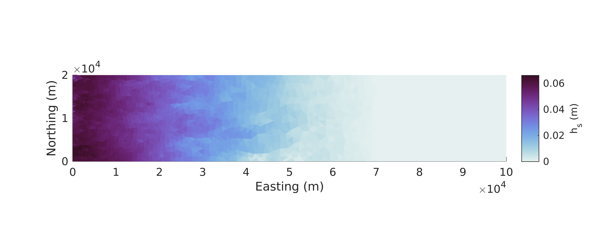
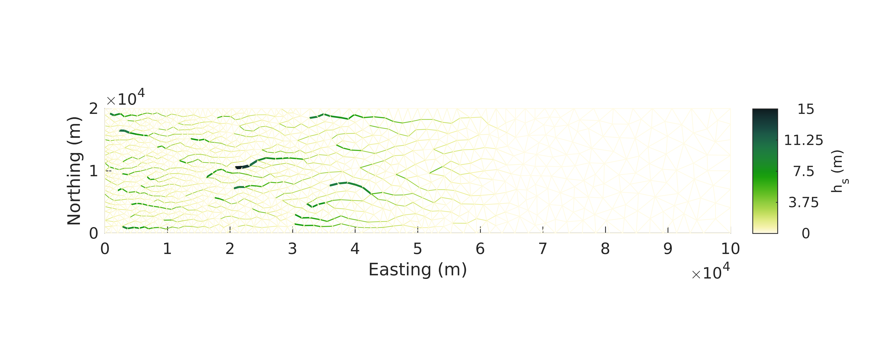

# Tutorial
This tutorial takes you through running a simple case using synthetic geometry and forcing. This tutorial is based in the `tests/SHMIP/` directory. There's a handful of MATLAB files here, so it's useful to talk about what each does:

 * `get_baseline_setup.m` sets most of the parameters for the simulation.
 * `shmip_elevation.m` calculates the surface elevation for the provided coordinate matrix
 * `shmip_melt.m` calculates surface melt using the SHMIP melt parameterization.
 * `plot_forcing.m` plots the SHMIP melt forcing
 * `spinup_baseline.`: This script runs the "spinup" simulation. Since SaDS builds a supraglacial river network, it's convenient to run the model for a short time (e.g. 12 hours) with spatially uniform channel dimensions to get an estimate of how much flow is through each edge in the mesh.
 * `run_test.m`: This script is that actually runs the SaDS model. Take a look in it - it doesn't do that much actually since the parameters are set by a different function. It uses the results of the `spinup_baseline.m` script to calculate initial channel dimensions.
 * `pickup_HC.m` is a helper function that calculates the channel incision depth for the `run_test.m` script.

The `data/` folder holds a text file providing moulin locations and the `test_mesh.mat` file with the triangular mesh.

Note that this case takes some time to run so it might be more convenient to run it on a Compute Canada machine.

## Step 1: Run the spinup case
As mentioned above, we run the model for 12 hours with a spatially uniform channel network to get an approximation of the steady state flow through the channels.

First, make sure you have a directory `outputs/`. This is where the model outputs will be saved.

Now, open the file `spinup_baseline.m`. This script runs the spinup simulation. See how most of the parameters and initial conditions are set by the `get_baseline_setup.m` function. Doing it this way ensures that the spinup and actual simulations use the same parameters. Take a look at this function to see what it does.

You should be able to run the spinup case now! If you are running locally (on your own computer as opposed to a Compute Canada machine), just run the script using MATLAB as usual. It only takes a few minutes to run.

If you are on a Compute Canada machine, submit the `submit_spinup.sh` script:

```
sbatch submit_spinup.sh
```

## Step 2: Run the actual simulation
Now we can run the actual simulation. As with the spinup case, look at the script `run_test.m` to see what it does.

Now, run it using the SLURM script `submit_test.sh` or as usual if you are running locally. Note this case takes longer to run (up to 30 minutes) so you may want to do it on the Compute Canada machines.

## Setup 3: Understand the outputs
While the model is running, you'll notice it produces outputs on the screen (or in the log file) tha t look like

```
>> spinup_baseline
Using RK time stepping
[             ] (t_model = 15724800.000000, t_wall = 0.515082, AbsConv = 0.000228)
[.            ] (t_model = 15728400.000000, t_wall = 11.874495, AbsConv = 0.027170)
[..           ] (t_model = 15732000.000000, t_wall = 23.229882, AbsConv = 0.086851)
[...          ] (t_model = 15735600.000000, t_wall = 34.564978, AbsConv = 0.073070)
[....         ] (t_model = 15739200.000000, t_wall = 46.411199, AbsConv = 0.088599)
[.....        ] (t_model = 15742800.000000, t_wall = 57.860533, AbsConv = 0.137125)
[......       ] (t_model = 15746400.000000, t_wall = 69.210069, AbsConv = 0.138315)
[.......      ] (t_model = 15750000.000000, t_wall = 80.684014, AbsConv = 0.160151)
[........     ] (t_model = 15753600.000000, t_wall = 92.567800, AbsConv = 0.257627)
[.........    ] (t_model = 15757200.000000, t_wall = 103.861314, AbsConv = 0.197309)
[..........   ] (t_model = 15760800.000000, t_wall = 115.075304, AbsConv = 0.218257)
[...........  ] (t_model = 15764400.000000, t_wall = 126.539341, AbsConv = 0.230892)
[.............] (t_model = 15768000.000000, t_wall = 138.402231, AbsConv = 0.231452)
```

This provides information on:

 * `t_model`: The timestep (in seconds) the model is currently on. This lets you measure the model's progress. The progress is also visualized with the dots within the square brackets.
 * `t_wall`: The walltime (in seconds) since the model was started.
 * `AbsConv`: This is the maximum absolute value of the time derivative of water depth multiplied by the timestep. Essentally, this is how much the water depth is changing within a single timestep. This lets you monitor how well it is doing with the timestep you have chosen.

## Step 4: Analyze the outputs
Look through the script `analyze_outputs.m` to see what it does. The `element_plot` and `edge_plot` functions are really just interfaces to MATLAB plotting functions but they make your life easy dealing with this weird triangular mesh data. For the most part, you will be using these functions along with standard line plots to visualize your outputs.

You should end up with beautiful figures like:



